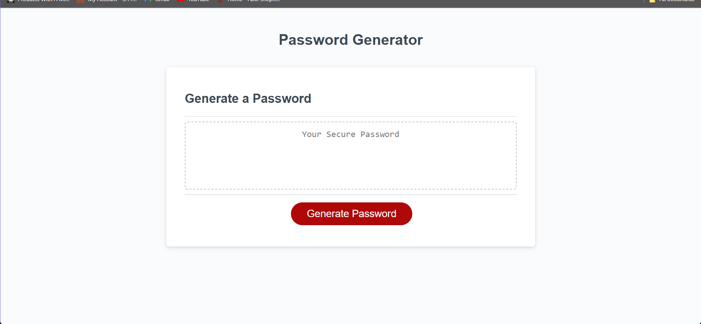

# JS-password-generator

A password generator built in JavaScript.

This application was built to allow the user to generate a completley randomized passowrd based off of the prompts they select.
the user has the option of adjusting the lenght of password (between 8 - 128 characters), lowercase/uppercase letter inclusion, as well as special character and numeric value inclusion.
https://echrist01.github.io/PassGenJS/

Help and referances:
Jay Wongani (tutor), stackoverflow, W3 School, MDN Web Docs.
